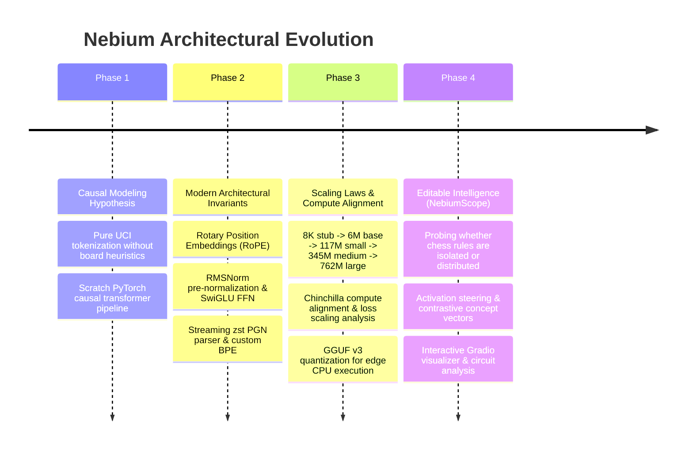

# Developer Journey & Engineering Log

Welcome to the **Nebium Developer Journey & Engineering Log** — a living, transparent record of how Nebium was built, why architectural decisions were made, what experiments failed, and what was learned along the way.

!!! note "What is this site?"
    This documentation acts as an **engineering journal**, an **Architecture Decision Record (ADR) repository**, and a **research log**. Unlike clean post-hoc papers that hide the messy iteration process, this site captures the authentic journey: hypotheses, false starts, bug investigations, and key insights.

---

## 🗺️ Project Milestones & Evolution

---

## 📚 Documentation Sections

-   :material-book-open-page-variant:{ .lg .middle } __[Dev Journal](journal/index.md)__

    ---

    Chronological entries detailing day-to-day engineering breakthroughs, why we chose specific methods, and what we learned.

    [:octicons-arrow-right-24: Read Dev Journal](journal/index.md)

-   :material-file-document-edit:{ .lg .middle } __[Architecture Decision Records (ADRs)](decisions/index.md)__

    ---

    Formal records capturing context, alternatives considered, decision trade-offs, and consequences (e.g. RoPE, SwiGLU, Hydra, GGUF).

    [:octicons-arrow-right-24: Browse ADRs](decisions/index.md)

-   :material-lightbulb-on:{ .lg .middle } __[Research & "What I Learned" (TIL)](learnings/attention-heads-in-chess.md)__

    ---

    Deep-dive explanations on concepts: attention heads in chess, perplexity in discrete games, and training stability.

    [:octicons-arrow-right-24: Explore Learnings](learnings/attention-heads-in-chess.md)

-   :material-format-list-checks:{ .lg .middle } __[Templates & Writing Guide](guide/how-to-write-dev-logs.md)__

    ---

    Copy-pasteable Markdown templates for logging new dev entries, writing ADRs, and post-mortems.

    [:octicons-arrow-right-24: View Templates](guide/how-to-write-dev-logs.md)

---

## 💡 Guiding Principles for Dev Logs

1. **Document the "Why", Not Just the "What":** Code tells you *how*; git commit history tells you *when*; dev logs tell you *why*.
2. **Celebrate Productive Failures:** Documenting why an approach didn't work (e.g. learned absolute positional embeddings failing on long game rollouts) is often 10x more valuable than a successful run.
3. **Evidence-Backed Prose:** Include exact loss numbers, perplexity scores, parameter counts, and benchmark comparisons.
4. **Reproducibility Over Magic:** Keep logs actionable with exact config flags, Hydra CLI commands, and test scripts.
