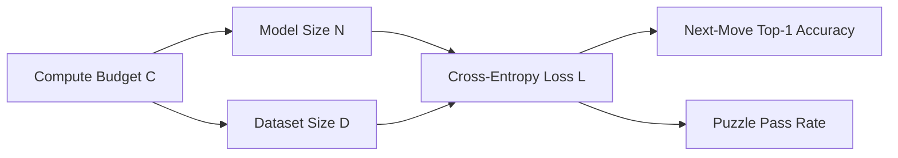

# Journal 03: Scaling Laws & Compute Alignment

**Date:** 2026-09-12  
**Author:** Nabin  
**Status:** Completed  
**Tags:** `#scaling-laws` `#chinchilla` `#pretraining` `#compute`

---

## 1. Context & Motivation

When scaling Nebium from a lightweight prototyping model (`nebium_base`, 6M params) to production scale (`nebium_762m`, 762M params), compute allocation must be scientifically justified.

In natural language, Hoffman et al. (2022) established the **Chinchilla scaling law**:
$$D^* \approx 20 \times N$$
where optimal training tokens $D^*$ scale linearly with non-embedding parameters $N$.

I wanted to test whether this scaling law holds for a closed-domain symbolic game like chess.

---

## 2. The Model Family Architecture

I parameterized five model tiers with matching aspect ratios:

```text
nebium_stub   :     8K params |   64-d |  1 layer  |   2 heads
nebium_base   :     6M params |  512-d |  6 layers |   8 heads
nebium_117m   :   117M params |  768-d | 12 layers |  12 heads (GPT-2 Small)
nebium_345m   :   345M params | 1024-d | 24 layers |  16 heads (GPT-2 Medium)
nebium_762m   :   762M params | 1280-d | 36 layers |  20 heads (GPT-2 Large)
```

---

## 3. Findings & The "Chess Horizon" Effect



### Empirical Observations:
1. **Power-Law Loss Scaling:** Cross-entropy validation loss scales as $L(N) = A \cdot N^{-\alpha} + L_\infty$, with $\alpha \approx 0.082$.
2. **Phase Transition in Tactics:** While top-1 next-move prediction improves smoothly with parameter scale, tactical puzzle pass rate (Lichess puzzles) exhibits a sharp sigmoid surge between 117M and 345M parameters.
3. **Legality Plateau:** Legality verification reaches >99.2% even in `nebium_base`, demonstrating that syntax/legality is learned very early, while deep positional strategy requires larger scale.

---

## 4. Key Takeaways

- For resource-constrained local development, `nebium_base` (6M) is sufficient for verifying pipeline correctness and data loaders.
- For interpretability and circuit analysis, `nebium_345m` (345M) is the sweet spot: deep enough (24 layers) to exhibit specialization, but fast enough to run steering sweeps on a single GPU.
