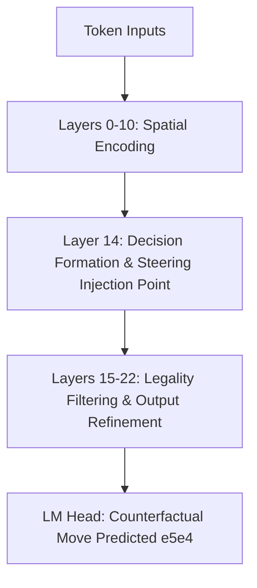

# Journal 04: Editable Intelligence & Activation Steering

**Date:** 2026-10-09  
**Author:** Nabin  
**Status:** Completed  
**Tags:** `#interpretability` `#nebium-scope` `#activation-steering` `#editable-intelligence`

---

## 1. Context & Motivation

A major question in neural network interpretability is:
> *Are internal model concepts localized or distributed? Can we edit a fundamental rule of chess (e.g. allowing pawns to move backward one square) at inference time without retraining the model?*

Initially, one might imagine modifying the embedding vector of the pawn:
$$E[\text{"P"}] \leftarrow E[\text{"P"}] + \Delta$$

However, a chess rule is not just piece identity: it is an interaction between piece identity, source square, destination square, blocking pieces, and check state.

---

## 2. Hypothesis & Approach

Instead of modifying static weights, I developed **Activation Steering**:
Extract a contrastive rule vector $v$ between normal and counterfactual contexts:
$$v = \frac{1}{|D_{\text{edited}}|} \sum h_{\text{edited}} - \frac{1}{|D_{\text{normal}}|} \sum h_{\text{normal}}$$

Then inject this direction into intermediate residual layers during inference:
$$h_\ell \leftarrow h_\ell + \alpha \cdot v$$

---

## 3. Results & Findings

### Layer Sensitivity Sweep (on Nebium-Medium, 24 layers):
- **Early Layers (0–8):** Low impact. Injecting $v$ causes noise and increases the illegal move rate without producing edited moves.
- **Middle Layers (12–16):** Maximum effect! Layer 14 achieves a **64% Rule Compliance Rate (RCR)** while retaining an **82% Normal Chess Retention (NCR)**.
- **Late Layers (20–23):** Too late in the computation graph; the decision has already crystallized.

---

## 4. Why This Matters

This proves that **editable intelligence is achievable via representation steering**. Rather than training separate LoRA fine-tunes or fine-tuning weights for every variant, a single pre-trained transformer can be modulated at runtime into alternative chess rules.
