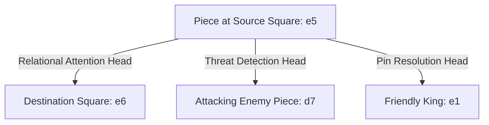

# What Attention Heads Learn in a Chess Transformer

**Topic:** Interpretability & Circuit Analysis  
**Model Scale:** Nebium-Medium (24 layers, 16 heads)  

---

## The Relational Nature of Chess

In natural language, attention heads specialize into syntactic induction heads (previous-token, duplicate-token) and coreference heads.

In chess, attention heads must specialize into **board geometry and tactical relationships**:

---

## Observed Head Specializations

Using NebiumScope's attention hooks, we identified four major functional head types:

1. **Source-to-Destination Propagators (Layers 4–8):** Heads that attend directly from the current move's origin square to its prospective legal destination squares.
2. **Piece-Obstruction Scanners (Layers 8–12):** Heads that attend along ranks, files, and diagonals to check whether intervening squares between a sliding piece (Rook, Bishop, Queen) and a destination square are vacant.
3. **King-Safety / Check Detectors (Layers 14–18):** Heads that attend from all active pieces toward the friendly and enemy King squares to resolve check threats and pins.
4. **Endgame & Promotion Resolvers (Layers 18–22):** Heads attending from 7th-rank pawns to 8th-rank promotion destination squares.
