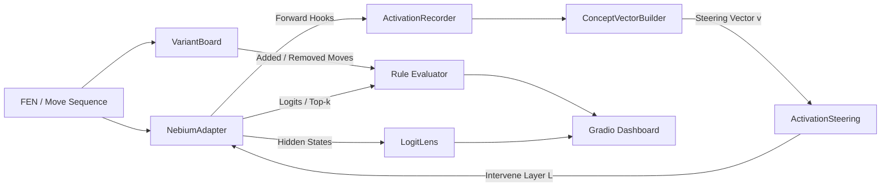

# NebiumScope Developer Guide & API Reference

`nebium_scope` is a research and interpretability toolkit for probing, visualizing, and steering chess rule representations in the **Nebium** causal Transformer family (specifically targeting Nebium-Medium: 345M parameters, 24 layers, 1024-d, 16 heads).

It is engineered for studying **editable intelligence**: altering core chess mechanics (e.g. pawn backwards movement, forward capture leaps, non-standard knight paths) through activation steering, representation probing, and logit-lens analysis—without retraining or destructive weight alterations.

---

## 1. Core Principles: Editable Intelligence

In causal autoregressive transformers trained on move sequences, chess rules are **not localized to single scalar weights or isolated embeddings**. They are distributed across a relational circuit:

1. **Piece & Coordinate Identity:** Encoded in token embeddings and early residual representations.
2. **Relational Geometry:** Head-to-head attention binding pieces to candidate destination squares, obstruction squares, and king lines.
3. **Legality & Affordance Transformation:** SwiGLU MLP layers computing non-linear conditional logic (e.g., pawn rank constraints, pin states).
4. **Logit Projection:** Unembedding projection maps final layer activations to next-move UCI tokens.

`nebium_scope` bridges the gap between **internal representations** and **external board behavior** through modular hooks, contrastive concept vectors, and interactive Gradio visualizers.

---

## 2. Architecture & Toolkit Layout

```text
nebium_scope/
├── rules/
│   ├── variant.py          # RuleVariant DSL and built-in presets (pawn_backward_one, etc.)
│   ├── board.py            # VariantBoard: Computes normal vs edited legal moves, added/removed deltas
│   └── positions.py        # Curated benchmark positions & contrast prompt generator
├── model/
│   ├── adapter.py          # NebiumAdapter: Unified interface for forward passes, tokenization & hooks
│   ├── dummy.py            # DummyNebiumModel: 24-layer 1024-d mock for rapid local dev & CI
│   └── hooks.py            # ActivationRecorder: Safe forward hook manager for residual blocks
├── interventions/
│   ├── steering.py         # ActivationSteering: Reversible h[layer][pos] += alpha * v intervention
│   └── vectors.py          # ConceptVectorBuilder: Contrastive rule direction extraction & serialization
├── analysis/
│   ├── logit_lens.py       # LogitLens: Projects layer hidden states through RMSNorm & lm_head
│   └── metrics.py          # RuleEvaluator: Rule Compliance Rate (RCR), Normal Retention (NCR), etc.
├── viz/
│   └── board.py            # render_scope_board: Multi-colored SVG board arrows (blue/orange/green)
└── app.py                  # Gradio dashboard application (Tabs: Explorer, Edit Lab, Lens, Benchmark)
```



---

## 3. Installation & Quickstart

### Prerequisites
`nebium_scope` is part of the `nebium` repository and utilizes Python 3.10+ (tested on Python 3.12).

```bash
# In the repository root
uv sync

# Or install in editable mode
pip install -e .
```

### Launching the Gradio Dashboard
You can run the interactive UI directly via Python or CLI:

```python
import nebium_scope as ns

# Launches Gradio on http://localhost:7860
# Automatically uses DummyNebiumModel if no checkpoint is passed
ns.launch(server_port=7860, share=False)
```

Or from your terminal:
```bash
python -m nebium_scope.app --port 7860
```

---

## 4. Programmatic API Reference

### 4.1 Defining Custom Rules with `VariantBoard`

The rule engine computes exact legal move sets for standard chess and arbitrary counterfactual variations without altering the global chess state.

```python
import chess
from nebium_scope.rules import VariantBoard, RuleVariant, get_rule_preset

# Load built-in preset
rule = get_rule_preset("pawn_backward_one")
board = VariantBoard(fen=chess.STARTING_FEN, variant=rule)

# Inspect standard vs edited legal moves
move_set = board.get_legal_moves()
print(f"Normal legal moves: {len(move_set.normal_legal_moves)}")
print(f"Edited legal moves: {len(move_set.edited_legal_moves)}")
print(f"Added moves: {move_set.added_moves}")
print(f"Removed moves: {move_set.removed_moves}")
```

#### Custom Rule Definitions via `RuleVariant`:
```python
custom_rule = RuleVariant(
    name="super_knight",
    piece="N",
    description="Knight can leap 2 squares orthogonally or standard L-shape",
    allow_diagonal_moves=True,
    add_custom_offsets=[(2, 0), (-2, 0), (0, 2), (0, -2)]
)
board = VariantBoard(variant=custom_rule)
```

---

### 4.2 Model Abstraction: `NebiumAdapter`

The `NebiumAdapter` provides an agnostic wrapper over custom weights, tokenizer, and residual block modules:

```python
import nebium
from nebium_scope.model import NebiumAdapter, DummyNebiumModel

# Production model loading:
model, tokenizer = nebium.load_model("medium") # 345M parameters
adapter = NebiumAdapter(model=model, tokenizer=tokenizer)

# Or instantiate Dummy model for fast headless unit testing:
dummy_adapter = NebiumAdapter(model=DummyNebiumModel(num_layers=24, d_model=1024))

# Predict next-move distribution
prompt = "e2e4 e7e5 g1f3"
top_moves = adapter.predict_top_k(prompt, k=5)
for move, prob in top_moves:
    print(f"{move}: {prob:.4f}")
```

---

### 4.3 Tracing Residual Decisions: `LogitLens`

The Logit Lens projects the residual stream from intermediate transformer blocks through `model.final_norm` and `model.lm_head` to identify the layer at which specific move decisions crystallize:

```python
from nebium_scope.analysis import LogitLens

lens = LogitLens(adapter)
df = lens.inspect_prompt("e2e4 e7e5", top_k=3)

# Returns a pandas DataFrame with columns:
# ['layer', 'top_move', 'probability', 'entropy', 'target_move_prob']
print(df.tail(6))
```

---

### 4.4 Contrastive Vector Extraction & Activation Steering

The core intervention mechanism extracts a steering vector $v$ representing the difference between edited-rule contexts and normal contexts, then injects it during inference:

$$h_{\ell}[t] \leftarrow h_{\ell}[t] + \alpha \cdot v$$

```python
import torch
from nebium_scope.interventions import ConceptVectorBuilder, ActivationSteering

# 1. Generate contrastive prompts for a target rule
from nebium_scope.rules.positions import get_contrast_dataset
dataset = get_contrast_dataset("pawn_backward_one")
normal_prompts = [item["normal_prompt"] for item in dataset]
edited_prompts = [item["edited_prompt"] for item in dataset]

# 2. Extract per-layer concept directions
vectors = ConceptVectorBuilder.extract_from_prompts(
    adapter=adapter,
    normal_prompts=normal_prompts,
    edited_prompts=edited_prompts,
    layers=[12, 14, 16],
    token_pos=-1
)

# Save vectors for reproducible experiments
ConceptVectorBuilder.save_vectors(vectors, "pawn_backward_vectors.pt")

# 3. Apply Reversible Activation Steering
steering = ActivationSteering(
    adapter=adapter,
    layer=14,
    vector=vectors[14],
    alpha=1.5,
    token_pos=-1
)

# Inference inside the steering context manager
prompt = "e2e4 e7e5 e4e5"
with steering:
    steered_top_moves = adapter.predict_top_k(prompt, k=5)

# Baseline inference without intervention
baseline_top_moves = adapter.predict_top_k(prompt, k=5)
```

---

### 4.5 Quantitative Evaluation: `RuleEvaluator`

```python
from nebium_scope.analysis import RuleEvaluator

evaluator = RuleEvaluator(adapter)
benchmark_item = {
    "prompt": "e2e4",
    "fen": "8/8/8/4P3/8/8/8/4K2k w - - 0 1",
    "normal_legal": ["e5e6"],
    "edited_legal": ["e5e6", "e5e4"],
    "added_moves": ["e5e4"]
}

# Evaluate baseline vs steered
base_res = evaluator.evaluate_position(benchmark_item, steering=None)
steer_res = evaluator.evaluate_position(benchmark_item, steering=steering)

print(f"Baseline Edited Legal: {base_res.is_edited_legal}")
print(f"Steered Edited Legal:  {steer_res.is_edited_legal}")
print(f"Steered Rule Comply:   {steer_res.complies_with_rule}")
```

#### Supported Metrics:
- **Rule Compliance Rate (RCR):** Fraction of benchmark positions where the top predicted move is in the target edited move set.
- **Normal Chess Retention (NCR):** Fraction of standard positions where the top move remains a legal standard move after intervention.
- **Illegal Move Rate (IMR):** Fraction of predictions that are illegal under *both* normal and edited chess rules.
- **Target Move Probability Delta ($\Delta P$):** Direct shift in softmax probability assigned to the counterfactual move.

### 4.6 Interactive Visual Diagrams (`nebium_scope.viz`)

NebiumScope provides five high-resolution, dark-themed diagnostic diagrams:

```python
from nebium_scope.viz import (
    plot_embedding_space,
    plot_activation_heatmap,
    plot_layer_dynamics,
    plot_logit_lens_trajectory,
    plot_transformer_flow_diagram,
)

# 1. 2D PCA projection of token embeddings with rule-edit shift vector (Δ)
fig_emb = plot_embedding_space(adapter, rule_variant_name="pawn_backward_one", edit_strength=1.5)

# 2. 2D Heatmap of |Δh| perturbation across token positions and feature channels
fig_heat = plot_activation_heatmap(adapter, prompt="e2e4 e7e5", layer=14, alpha=1.5)

# 3. Layer dynamics: ||Δh_L||_2 perturbation norm and cosine similarity across depth
fig_dyn = plot_layer_dynamics(adapter, prompt="e2e4 e7e5", steering_layer=14, alpha=1.5)

# 4. Logit lens trajectory: Baseline vs Steered move probabilities + phase transition marker
fig_traj = plot_logit_lens_trajectory(
    lens, prompt="e2e4 e7e5", normal_move="e5e6", edited_move="e5e4", steering_layer=14, alpha=1.5
)

# 5. Architecture circuit flow schematic showing signal flow and injection point
fig_flow = plot_transformer_flow_diagram(num_layers=24, injection_layer=14, alpha=1.5)
```

---

## 5. End-to-End Experiment: Pawn-Backward Steering on Nebium-Medium

Here is a complete standalone script demonstrating how to run an $\alpha$-sweep experiment across middle-to-late transformer layers:

```python
import pandas as pd
from nebium_scope.model import NebiumAdapter, DummyNebiumModel
from nebium_scope.interventions import ConceptVectorBuilder, ActivationSteering
from nebium_scope.analysis import RuleEvaluator
from nebium_scope.rules.positions import get_benchmark_positions

def run_steering_sweep():
    # Setup model adapter
    adapter = NebiumAdapter(DummyNebiumModel(num_layers=24, d_model=1024))
    evaluator = RuleEvaluator(adapter)
    benchmark = get_benchmark_positions("pawn_backward_one")

    # Generate or load steering vector
    vector = ConceptVectorBuilder.generate_mock_vector(d_model=1024)

    target_layers = [10, 12, 14, 16]
    alpha_values = [0.0, 0.5, 1.0, 1.5, 2.0, 3.0]
    results = []

    for layer in target_layers:
        for alpha in alpha_values:
            steering = ActivationSteering(
                adapter=adapter,
                layer=layer,
                vector=vector,
                alpha=alpha
            ) if alpha > 0 else None

            summary = evaluator.evaluate_benchmark(benchmark, steering=steering)
            results.append({
                "layer": layer,
                "alpha": alpha,
                "rcr": summary["rule_compliance_rate"],
                "ncr": summary["normal_retention_rate"],
                "imr": summary["illegal_move_rate"],
                "mean_delta_prob": summary["mean_added_move_delta"]
            })

    df = pd.DataFrame(results)
    print(df.to_markdown())
    return df

if __name__ == "__main__":
    run_steering_sweep()
```

---

## 6. Gradio Dashboard Tour

The Gradio dashboard exposes 5 dedicated tabs optimized for visual exploratory analysis:

1. **Position & Rule Explorer:**
   - Input custom FEN or move history.
   - Live board visualization rendered as high-res SVG.
   - Color-coded arrows: **Blue** (Top model predictions), **Orange** (Added rule moves), **Green** (User selected target).
   - Side-by-side display of normal vs edited move sets and top move predictions.

2. **Causal Edit Lab:**
   - Interactive $\alpha$ slider ($0.0 \le \alpha \le 3.0$) and layer picker ($0 \dots 23$).
   - **Side-by-side board comparison panel:** Baseline prediction board vs Steered prediction board.
   - Real-time comparison table showing baseline probability, steered probability, and percentage deltas.

3. **Visual Representation Explorer:**
   - **Embedding Space (2D PCA):** PCA projection of piece and square tokens showing displacement induced by rule vector.
   - **Layer Activation Heatmap:** 2D Heatmap of $|\Delta h|$ across tokens and feature dimensions.
   - **Transformer Depth Dynamics:** Two stacked panels charting perturbation norm $\| \Delta h_\ell \|_2$ and cosine similarity across all 24 layers.
   - **Logit Lens Phase Transition:** Softmax probability trajectories across depth highlighting the exact layer where the counterfactual rule prediction emerges.
   - **Architecture Flow Diagram:** Schematic circuit diagram illustrating token embeddings $\rightarrow$ transformer blocks $\rightarrow$ injection point $\rightarrow$ output logits.

4. **Logit Lens Table Inspector:**
   - Depth-wise progression table charting top predicted move, top probability, entropy, and top candidates across all 24 layers.

5. **Rule Benchmark Suite:**
   - Batch evaluation across curated position datasets.
   - Automated calculation of RCR, NCR, and IMR metrics with structured summary displays.

---

## 7. Extending NebiumScope

### Adding a New Rule Variant
To implement a new rule transformation, register it in `nebium_scope/rules/variant.py`:

```python
register_rule_preset(
    RuleVariant(
        name="bishop_orthogonal_one",
        piece="B",
        description="Bishops can also take one step orthogonally.",
        allow_orthogonal_moves=True,
        orthogonal_distance=1
    )
)
```

The `VariantBoard` move generator will immediately recognize the new variant and compute corresponding move additions and exclusions.
